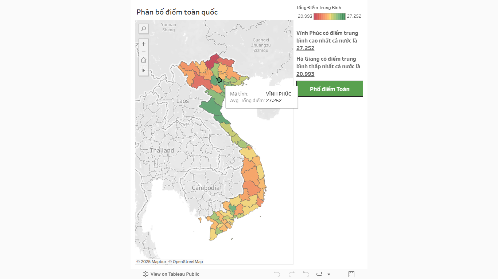
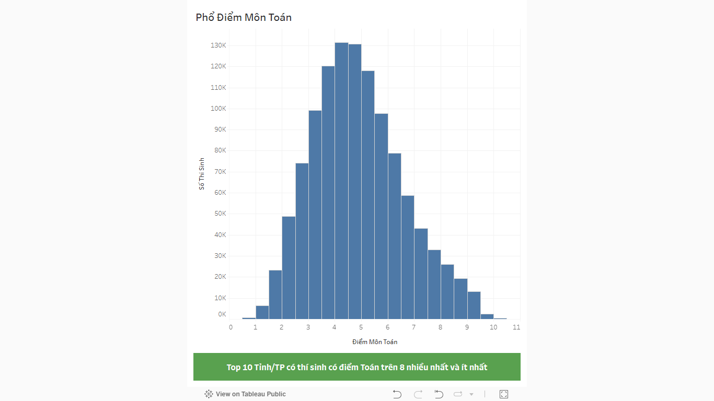
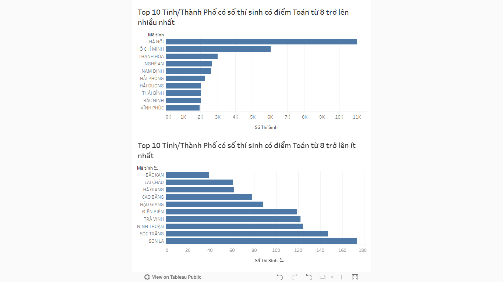

# VietExam-Insights

VietExam-Insights là một bộ công cụ Python để thu thập và tiền xử lý dữ liệu điểm thi tốt nghiệp THPT quốc gia Việt Nam. Mục tiêu của repository là cung cấp một pipeline đơn giản để:

- Thu thập dữ liệu điểm thô từ API công khai
- Tiền xử lý và chuẩn hóa dữ liệu thành định dạng phân tích được

## Cấu trúc chính

- `data/raw/` - chứa dữ liệu thô (CSV) tải về từ bước crawl
- `data/processed/` - chứa dữ liệu đã tiền xử lý sẵn sàng cho phân tích
  - `viet_national_exam_scores.csv` - dữ liệu chính sau xử lý
- `src/` - mã nguồn Python
  - `crawl_scores.py` - crawler lấy dữ liệu điểm và lưu ra CSV thô
  - `process_data.py` - tiền xử lý: đổi tên cột, ánh xạ mã tỉnh, lưu CSV processed

## Mô tả chức năng các file

- `src/crawl_scores.py`
  - Mục đích: gọi API theo dãy số báo danh (SBD) để thu thập điểm thô và lưu vào `data/raw/raw_national_exam_scores_YYYY.csv`.
  - Lưu ý: script có cơ chế sleep giữa các request; khi thu thập số lượng lớn cần tuân thủ giới hạn của nguồn dữ liệu.

- `src/process_data.py`
  - Mục đích: đọc file raw CSV, đổi tên cột sang tiếng Việt, trích mã tỉnh (2 chữ số đầu của SBD) và ánh xạ sang tên tỉnh; kết quả được ghi ra `data/processed/viet_national_exam_scores.csv` (UTF-8-sig).

## Cài đặt & Chạy (Windows PowerShell)

1. Tạo virtual environment và cài đặt phụ thuộc tối thiểu:

```powershell
python -m venv .venv
.\.venv\Scripts\Activate.ps1
pip install -r requirements.txt
```

2. Chạy các bước chính:

- Thu thập dữ liệu (ví dụ chạy với dải SBD nhỏ để kiểm thử):

```powershell
python .\src\crawl_scores.py
```

- Tiền xử lý dữ liệu:

```powershell
python .\src\process_data.py
```

Ghi chú: các script hiện tại thực thi công việc chính khi được chạy trực tiếp. Để sử dụng như module, cần tách logic thành hàm và gọi có kiểm soát.

## Dữ liệu mẫu (demo)

Dưới đây là mẫu trích từ `data/processed/demo_viet_national_exam_scores.csv` (10 dòng đầu) để mô tả cấu trúc dữ liệu:

| Số báo danh | Mã tỉnh | Toán | Ngữ văn | Ngoại ngữ | Vật lý | Hóa học | Sinh học | Lịch sử | Địa lý | Tin học | CN Công nghiệp | CN Nông nghiệp | GD Kinh tế và Pháp luật | Tổng điểm |
| :---: | :---: | :---: | :---: | :---: | :---: | :---: | :---: | :---: | :---: | :---: | :---: | :---: | :---: | :---: |
| 01000001 | HÀ NỘI | 5.75 | 7.75 | | | 7.75 | 8.25 | | | | | | | 29.5 |
| 01000002 | HÀ NỘI | 8.0 | 8.25 | | 8.5 | 6.75 | | | | | | | | 31.5 |
| 01000003 | HÀ NỘI | 6.75 | 8.5 | | 8.75 | | | | | | | | | 24.0 |
| 01000004 | HÀ NỘI | 5.25 | 7.5 | | 6.5 | 5.5 | | | | | | | | 24.75 |
| 01000005 | HÀ NỘI | | 7.0 | | | | 5.5 | 6.25 | | | | | | 18.75 |
| 01000006 | HÀ NỘI | 6.5 | 8.5 | | 7.25 | 5.0 | | | | | | | | 27.25 |
| 01000007 | HÀ NỘI | 6.35 | 8.0 | | | 6.25 | 7.35 | | | | | | | 27.95 |
| 01000008 | HÀ NỘI | | 6.25 | | | | 4.0 | 4.0 | | | | | | 14.25 |
| 01000009 | HÀ NỘI | 7.5 | 8.5 | | 7.75 | 6.0 | | | | | | | | 29.75 |
| 01000010 | HÀ NỘI | | 8.75 | | | | 8.25 | 9.0 | | | | | | 26.0 |

## Phần dành cho ảnh Tableau (chèn ảnh vào `docs/` hoặc `assets/`)

Hướng dẫn: lưu ảnh dashboard vào thư mục `docs/` hoặc `assets/` rồi cập nhật đường dẫn trong README.

### Biểu đồ 1 — Phân bố điểm trung bình các môn thi của cả nước



### Biểu đồ 2 — Phổ điểm môn Toán



### Biểu đồ 3 — Top 10 các Tỉnh/Thành Phố có số thí sinh trên 8 điểm Toán nhiều nhất và ít nhất




